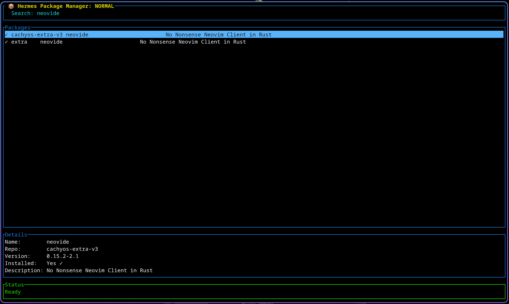
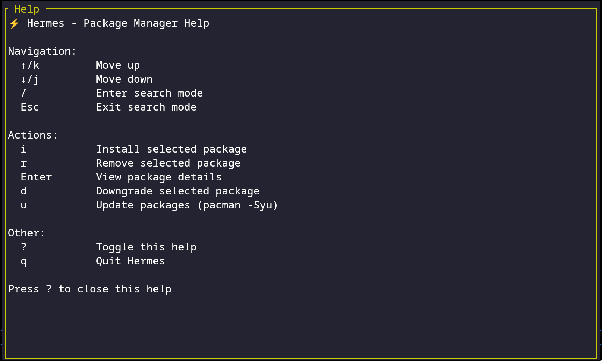
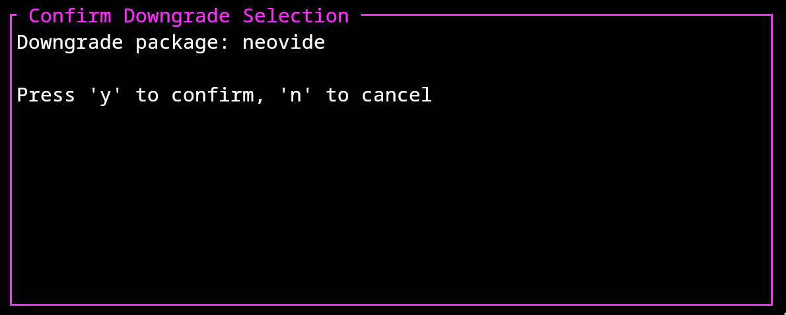

# ⚡ Hermes Package Manager


A beautiful TUI package manager for Arch Linux, written in Rust.

## Features

- 🔍 Real-time package search (currently requiring 2 characters typed first)
- 📦 Install/remove packages with confirmation
- ✨ Beautiful terminal UI (or soon to be)
- ⚡ Fast and efficient using libalpm
- 🎯 Vim-style keybindings
- Built in Rust

 

Get keybind help using `?` in Normal Mode in the program.

 

Downgrade packages with the downgrade package.




## Installation

### AUR
Use your favorite AUR helper to install!
```
paru hermes-pm
yay hermes-pm
```

### From Source
```bash
# Download latest release
wget https://github.com/yourusername/hermes/releases/latest/download/hermes-x86_64-linux.tar.gz

# Extract and install
tar -xzf hermes-x86_64-linux.tar.gz
sudo mv hermes /usr/local/bin/

# Run
sudo hermes
```

## Development
```bash
# Clone repo
git clone https://github.com/yourusername/hermes.git
cd hermes

# Run tests
cargo test

# Build
cargo build --release

# Run locally
sudo ./target/release/hermes
```

## Keybindings

- `/` - Search mode
- `↑/k` - Move up
- `↓/j` - Move down
- `i` - Install package
- `r` - Remove package
- `?` - Help
- `q` - Quit

## License

MIT
